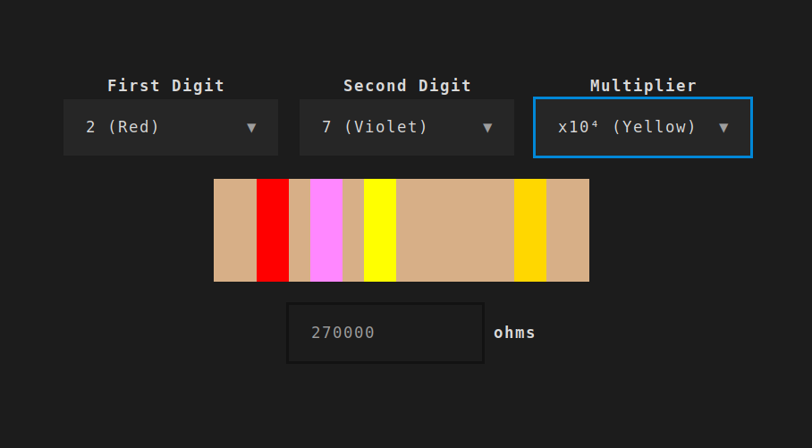

# rescol

A resistor color code calculator in the terminal

## About

I've recently started tinkering with electronics, so created this toy project
to learn the resistor color codes.

Currently this displays a four-band resistor as apparently this is most common,
but the forth tolerance band isn't implemented (yet).

## Resources

- [Electronics Club](https://electronicsclub.info/) is a great website
  for beginners to start learning electronics, including an introduction to
  [resistors](https://electronicsclub.info/resistors.htm)

## Licence

Licensed under the [GNU General Public License v3.0](LICENSE).
